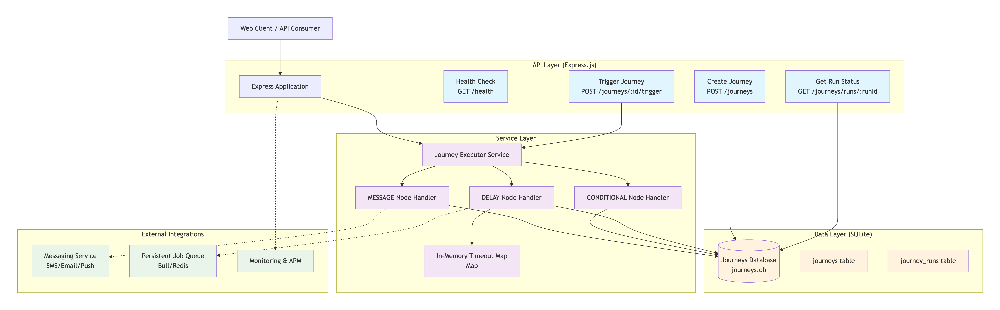

# Patient Care Journey Engine

A backend journey orchestration engine that executes patient care pathways with support for messages, delays, and conditional branching.

## 🏗️ Architecture

### System Overview



### Journey Execution Flow

```
    POST /journeys/:id/trigger
             │
             ▼
    ┌─────────────────┐
    │ Create Run      │  Status: in_progress
    │ Return 202      │  current_node_id: start_node_id
    └────────┬────────┘
             │
             ▼  Async Execution
    ┌─────────────────┐
    │ Fetch Journey   │
    │ Fetch Run       │
    └────────┬────────┘
             │
             ▼
    ┌─────────────────┐
    │ Find Node by    │
    │ current_node_id │
    └────────┬────────┘
             │
         ┌───┴───┐
         │ Type? │
         └───┬───┘
             │
     ┌───────┼───────┐
     │       │       │
     ▼       ▼       ▼
┌─────────┐ ┌────────────┐ ┌──────────┐
│ MESSAGE │ │CONDITIONAL │ │  DELAY   │
└────┬────┘ └─────┬──────┘ └─────┬────┘
     │            │               │
     │  Log msg   │  Evaluate     │  setTimeout
     │  Update DB │  condition    │  (wait)
     │            │  Update DB    │  Update DB
     │            │               │
     └────┬───────┴───────────────┘
          │
          ▼
    ┌──────────────┐
    │ next_node_id?│
    └──────┬───────┘
           │
      ┌────┴────┐
      │         │
   Yes│        │No
      │         │
      ▼         ▼
  Continue   Mark as
  to Next    completed
   Node
```

### Technology Stack

- **Language**: TypeScript 5.7.2+ with strict mode
- **Runtime**: Node.js 18+ (LTS)
- **Framework**: Express.js 4.21.1+
- **Database**: SQLite with better-sqlite3 11.7.0 (zero-config, file-based)
- **Testing**: Jest 30.2.0 + Supertest 7.1.4
- **Async Processing**: setTimeout with in-memory tracking
- **IDs**: UUID 8.3.2+ for unique identifiers (CommonJS compatible)

## 📁 Project Structure

```
├── src/
│   ├── types/           # TypeScript interfaces
│   ├── db/              # Database setup & queries
│   ├── services/        # Business logic (executor)
│   ├── routes/          # API endpoints
│   ├── app.ts           # Express app setup
│   └── server.ts        # Server entry point
├── tests/
│   ├── unit/            # Unit tests (30 tests)
│   ├── integration/     # Integration tests (22 tests)
│   ├── test-executor.sh # Manual executor testing script
│   ├── test-get-endpoint.sh # Manual API endpoint testing script
│   ├── test-journey.json # Sample test journey data
│   └── TESTING.md       # Comprehensive testing documentation
├── examples/            # Sample journey JSON files
├── static/              # Static assets
│   └── architecture.png # System architecture diagram
├── MVP/                 # Production enhancement proposals
│   ├── retry-enhancement-proposal.md           # Advanced retry mechanisms
│   └── postgresql-connection-pooling-proposal.md # PostgreSQL connection pooling
├── package.json         # Dependencies and scripts
├── tsconfig.json        # TypeScript configuration
├── jest.config.js       # Jest testing configuration
└── README.md           # Project documentation
```

## 🚀 Quick Start

### Prerequisites

- Node.js 18+ (LTS)
- npm or yarn

### Installation

1. **Clone and setup the project:**

   ```bash
   git clone <repository-url>
   cd patient-care-journey-engine
   npm install
   ```

2. **Start the development server:**

   ```bash
   npm run dev
   ```

3. **The server will start on port 3000:**
   ```
   🚀 Patient Care Journey Engine started successfully!
   📚 API Server running on: http://localhost:3000
   🏥 Health check available at: http://localhost:3000/health
   ```

## 📡 API Endpoints

### Health Check

```http
GET /health
```

**Response (200 OK):**

```json
{
  "status": "healthy",
  "timestamp": "2025-11-11T19:36:21.135Z",
  "service": "Patient Care Journey Engine"
}
```

### 1. Create Journey

```http
POST /journeys
Content-Type: application/json
```

**Request Body:**

```json
{
  "name": "Simple Welcome Journey",
  "start_node_id": "welcome",
  "nodes": [
    {
      "id": "welcome",
      "type": "MESSAGE",
      "message": "Welcome to your care journey!",
      "next_node_id": "check_age"
    },
    {
      "id": "check_age",
      "type": "CONDITIONAL",
      "condition": {
        "field": "age",
        "operator": ">",
        "value": 65
      },
      "on_true_next_node_id": "senior_message",
      "on_false_next_node_id": "general_message"
    },
    {
      "id": "senior_message",
      "type": "MESSAGE",
      "message": "As a senior patient, you have access to specialized care programs.",
      "next_node_id": null
    },
    {
      "id": "general_message",
      "type": "MESSAGE",
      "message": "Thank you for choosing our care program!",
      "next_node_id": null
    }
  ]
}
```

**Response (201 Created):**

```json
{
  "journey_id": "6ad40b69-b577-49c9-abc7-feed24d2e98a"
}
```

### 2. Trigger Journey Execution

```http
POST /journeys/:journeyId/trigger
Content-Type: application/json
```

**Request Body:**

```json
{
  "patient_context": {
    "id": "patient-123",
    "age": 70,
    "language": "en",
    "condition": "hip_replacement"
  }
}
```

**Response (202 Accepted):**

```json
{
  "run_id": "fc510827-9240-46c3-8598-aaf7f07bfbe0"
}
```

**Headers:**

- `Location: /journeys/runs/fc510827-9240-46c3-8598-aaf7f07bfbe0`

### 3. Get Journey Run Status

```http
GET /journeys/runs/:runId
```

**Success Response (200 OK):**

```json
{
  "id": "445ccbdc-49ba-4b21-8354-8a1e55e52470",
  "journey_id": "97b1a13b-9428-4094-8832-7983e1699470",
  "patient_context": {
    "id": "patient-456",
    "age": 45,
    "language": "es",
    "condition": "knee_replacement"
  },
  "status": "in_progress",
  "current_node_id": "welcome",
  "created_at": "2025-11-12T03:54:21.000Z",
  "updated_at": "2025-11-12T03:54:21.000Z"
}
```

**Error Response (404 Not Found):**

```json
{
  "error": "Journey run not found",
  "run_id": "non-existent-id"
}
```

**Response Fields:**

- `id` - Unique run identifier (UUID)
- `journey_id` - Reference to the journey definition
- `patient_context` - Full patient information provided at trigger
- `status` - Current execution status (`in_progress`, `completed`, `failed`)
- `current_node_id` - ID of the node currently being processed (null if completed/failed)
- `created_at` - ISO 8601 timestamp of run creation
- `updated_at` - ISO 8601 timestamp of last update

## 🧩 Journey Node Types

### MESSAGE Node

Sends a message to the patient (logged to console).

```json
{
  "id": "welcome",
  "type": "MESSAGE",
  "message": "Welcome to your care journey!",
  "next_node_id": "next_step"
}
```

**Execution Behavior:**

- Logs message to server console with patient ID
- Updates `current_node_id` to `next_node_id`
- If `next_node_id` is null, marks journey as `completed`
- Continues to next node automatically

### DELAY Node

Waits for specified duration before continuing.

```json
{
  "id": "wait_24h",
  "type": "DELAY",
  "delay_seconds": 86400,
  "next_node_id": "follow_up"
}
```

**Execution Behavior:**

- Schedules continuation with `setTimeout`
- Stores timeout reference in memory (Map<runId, NodeJS.Timeout>)
- Updates database status to `in_progress` before waiting
- Resumes execution after delay completes
- **Note:** Delays do not survive server restarts

### CONDITIONAL Node

Branches based on patient context evaluation.

```json
{
  "id": "age_check",
  "type": "CONDITIONAL",
  "condition": {
    "field": "age",
    "operator": ">",
    "value": 65
  },
  "on_true_next_node_id": "senior_path",
  "on_false_next_node_id": "general_path"
}
```

**Supported Operators:**

- `>`, `<`, `>=`, `<=` - Numeric comparisons
- `=`, `!=` - Equality/inequality (any type)

**Execution Behavior:**

- Evaluates condition against patient context
- Supports nested field paths (e.g., `patient.age` or just `age`)
- Branches to `on_true_next_node_id` or `on_false_next_node_id` based on result
- Logs evaluation result to console
- Continues to selected branch automatically

## ⚙️ Journey Execution

### How It Works

When a journey is triggered via `POST /journeys/:id/trigger`:

1. **Initialization:**

   - Creates a new `journey_run` record with status `in_progress`
   - Sets `current_node_id` to the journey's `start_node_id`
   - Returns 202 Accepted immediately (non-blocking)

2. **Async Execution:**

   - Executor starts processing in the background
   - Processes nodes sequentially, one at a time
   - Updates database after each node

3. **Node Processing Loop:**

   ```
   Start → Fetch Run → Fetch Journey → Find Current Node → Process Node
           ↑                                                      ↓
           └──────────── Continue to Next Node ←─────────────────┘
   ```

4. **Completion:**
   - Journey marked as `completed` when reaching a terminal node
   - Journey marked as `failed` if error occurs during processing

### Example Execution Flow

```
[EXECUTOR] Starting execution for run ec7cd8ec-f8ab-42aa-9abf-9eb77d0ef4d3
[EXECUTOR] Processing node msg1 (MESSAGE) for run ec7cd8ec...
[MESSAGE] Sending message to patient patient-001: Welcome! Starting your journey...
[EXECUTOR] Processing node cond1 (CONDITIONAL) for run ec7cd8ec...
[CONDITIONAL] Evaluating condition: age > 65
[CONDITIONAL] Result: true
[EXECUTOR] Processing node msg_senior (MESSAGE) for run ec7cd8ec...
[MESSAGE] Sending message to patient patient-001: You qualify for senior care programs!
[EXECUTOR] Journey run ec7cd8ec-f8ab-42aa-9abf-9eb77d0ef4d3 completed
```

### State Management

- **Database:** Persistent storage for journey definitions and run state
- **In-Memory:** Active delay timeouts (Map<runId, NodeJS.Timeout>)
- **Status Updates:** After each node, `current_node_id` updated in database
- **Error Handling:** Failed runs marked as `failed` with error logging

## 🧪 Manual Testing

Test the API using curl commands:

````bash
# 1. Create a journey
curl -X POST http://localhost:3000/journeys \
  -H "Content-Type: application/json" \
  -d @examples/simple-message.json

2. **Trigger execution:**

   ```bash
   curl -X POST http://localhost:3000/journeys/{JOURNEY_ID}/trigger \
     -H "Content-Type: application/json" \
     -d '{"patient_context":{"id":"patient-123","age":70,"language":"en","condition":"hip_replacement"}}'
````

# 3. Check status

curl http://localhost:3000/journeys/runs/{RUN_ID}

````

## 🛠️ Development

### Available Scripts

- `npm run dev` - Start development server with hot reload
- `npm run build` - Build TypeScript to JavaScript
- `npm start` - Start production server
- `npm test` - Run test suite (52 tests)
- `npm run test:watch` - Run tests in watch mode
- `npm run test:coverage` - Run tests with coverage report (74% coverage)

### Testing

Comprehensive test suite with 52 tests and 74% coverage:

- **30 Unit Tests**: Conditional evaluator, executor logic
- **22 Integration Tests**: API endpoints, E2E flows

```bash
npm test              # Run all tests
npm run test:coverage # Run with coverage report
npm run test:watch    # Watch mode for development
````

For detailed testing documentation, see [TESTING.md](TESTING.md).

### Database

- **Type**: SQLite
- **Location**: `journeys.db` (auto-created)
- **Schema**: Automatically initialized on startup
- **Tables**: `journeys`, `journey_runs`

## 🔧 Configuration

### Environment Variables

- `PORT` - Server port (default: 3000)
- `NODE_ENV` - Environment mode (development/production)

### Database Configuration

The SQLite database is automatically created and initialized with the required schema on first startup. No additional configuration needed.

## 🎯 Design Decisions & Assumptions

### Architecture Choices

1. **SQLite Database:**

   - File-based storage for simplicity and zero configuration
   - Single file (`journeys.db`) contains all data
   - Auto-initialization of schema on startup
   - Perfect for development and single-instance deployments

2. **In-Memory Timeout Tracking:**

   - Active DELAY nodes tracked in JavaScript Map
   - Fast and efficient for single-server setup
   - **Limitation:** Delays do not survive server restarts
   - **Production Alternative:** Use external job queue (Bull, BullMQ, etc.)

3. **Synchronous Node Processing:**

   - Nodes processed one at a time, in sequence
   - Simpler to reason about and debug
   - Database updated after each node
   - **Alternative:** Could parallelize independent branches

4. **Async Journey Execution:**
   - POST /trigger returns 202 immediately
   - Execution happens in background (non-blocking)
   - Status checked via GET /runs/:runId
   - Follows async processing best practices

### Execution Behavior

- **MESSAGE Nodes:** Logged to console (in production, would integrate with messaging service)
- **CONDITIONAL Nodes:** Simple expression evaluation (no complex logic support)
- **DELAY Nodes:** setTimeout-based (production would use durable job queue)
- **Error Handling:** Failed journeys marked as `failed` with error logging

## Error Handling

The API provides detailed error responses:

- `400 Bad Request` - Validation errors (missing fields, invalid references, duplicate node IDs)
- `404 Not Found` - Journey or run not found
- `500 Internal Server Error` - Server errors

**Validation includes:**

- Structure validation and required fields
- Reference integrity (all `next_node_id` values exist)
- Node-specific requirements (CONDITIONAL operators, etc.)
- Execution errors are caught and runs marked as `failed`

## ⚠️ Known Limitations

1. **Delay Persistence:**

   - DELAY nodes use in-memory `setTimeout`
   - Active delays are lost on server restart
   - Run remains in `in_progress` state after restart
   - **Production Solution:** Use persistent job queue (Redis, RabbitMQ, Bull)

2. **Scalability:**

   - Single-instance design (in-memory state)
   - SQLite has write concurrency limits
   - **Production Solution:** PostgreSQL + distributed job queue

3. **Retry Mechanism:**

   - No automatic retry for failed nodes
   - Failed journeys require manual intervention
   - **Future Enhancement:** Implement retry logic with exponential backoff

4. **Parallel Execution:**

   - Nodes processed sequentially only
   - No support for concurrent branches
   - **Future Enhancement:** DAG-based execution with parallel paths

5. **Condition Evaluation:**
   - Simple expressions only (field operator value)
   - No complex logic (AND/OR combinations)
   - No nested conditions
   - **Future Enhancement:** Expression language support

## ⚠️ Production Readiness Notice

**This implementation is designed for prototype and development environments only.** For production deployment, the following epics/stories must be completed to ensure availability, scalability, stability, monitoring, and security:

### Required Production Epics

- **Epic 1: High Availability & Scalability**

  - Implement distributed job queue (Bull/BullMQ + Redis)
  - Database migration from SQLite to PostgreSQL/MongoDB
  - Database [connection pooling](./MVP/postgresql-connection-pooling-proposal.md) for high concurrency support
  - Horizontal scaling with load balancing
  - Container orchestration (Kubernetes/Docker Swarm)

- **Epic 2: Stability & Reliability**

  - Comprehensive error handling and [retry mechanisms](./MVP/retry-enhancement-proposal.md) (e.g. automatic retry with exponential backoff)
  - Circuit breaker patterns for external dependencies
  - Graceful shutdown and restart capabilities
  - Data backup and disaster recovery procedures

- **Epic 3: Monitoring & Observability**

  - Application Performance Monitoring (APM)
  - Structured logging with centralized log aggregation
  - Health check endpoints and service discovery
  - Metrics collection and alerting (Prometheus/Grafana)

- **Epic 4: Security & Compliance**

  - Authentication and authorization (OAuth 2.0/JWT)
  - API rate limiting and DDoS protection
  - Data encryption at rest and in transit
  - Security scanning and vulnerability assessments

- **Epic 5: DevOps & Infrastructure**
  - CI/CD pipeline with automated testing
  - Infrastructure as Code (Terraform/CloudFormation)
  - Environment configuration management
  - Blue-green deployment strategies

## 📄 License

MIT
